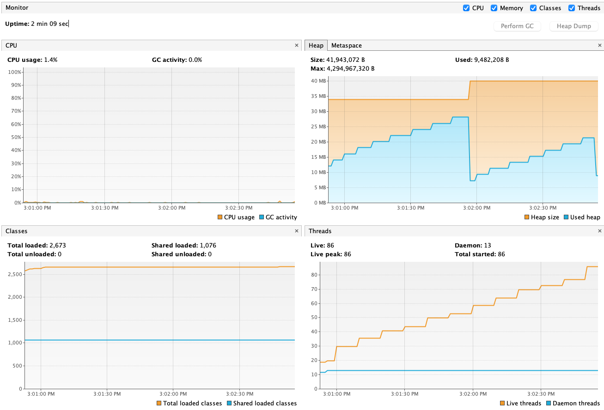
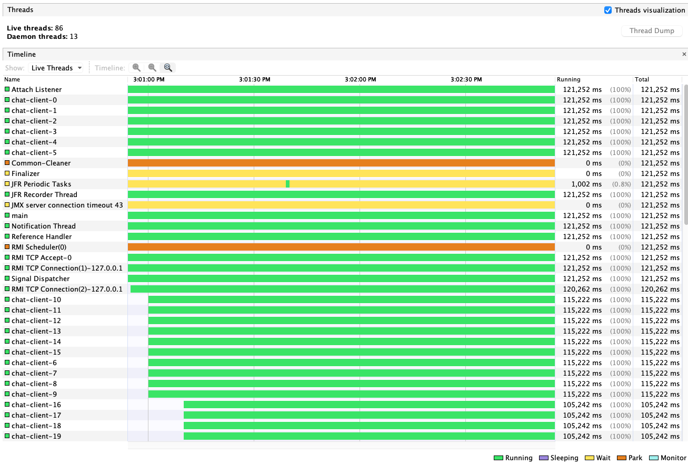
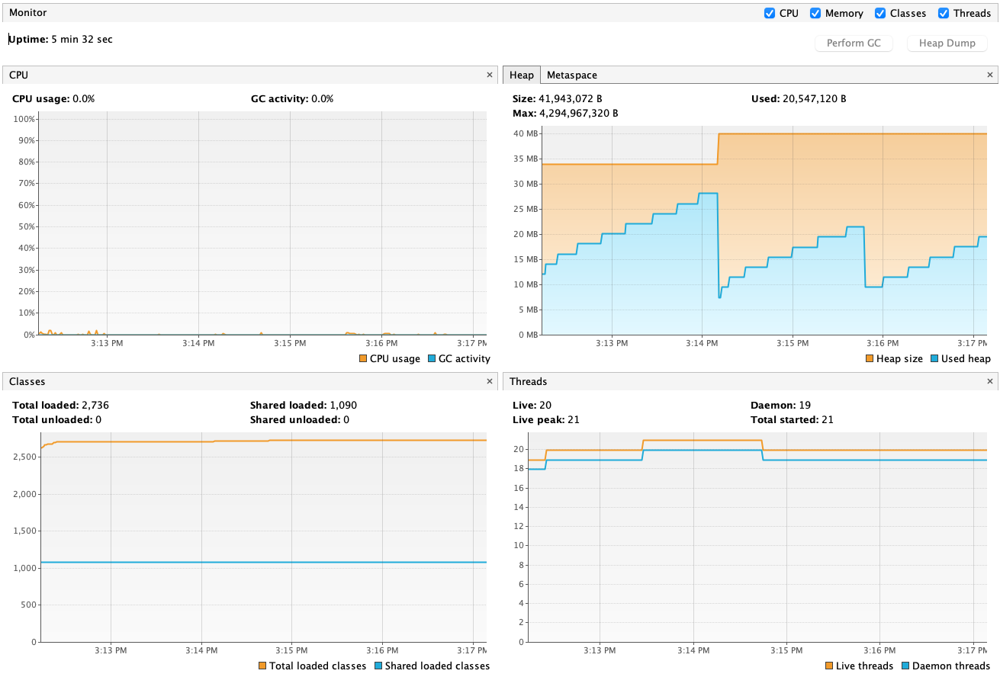
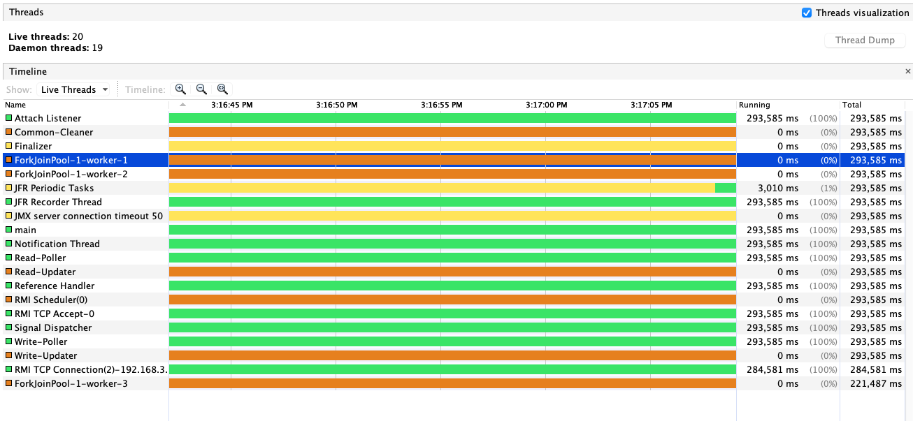
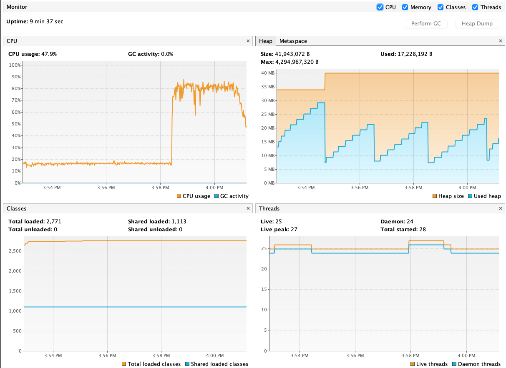
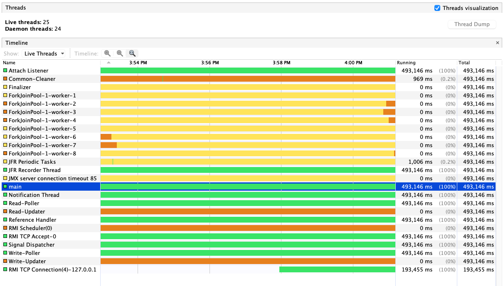

# Java Chat using Virtual Threads

This projects aims to show the differences between platform threads (common Java Thread) and the new JEP Virtual Threads.

To run you need to use JDK 19 (EA build at time), you can download it from [here](https://jdk.java.net/19/).

## Projects

### Server

This chat server has 3 modes to run:

- `M`: monothread to show the problem using monothread to handle many tasks (the chat clients is queued and each one at time talks to the server);
- `P`: multithread using platform thread where for each client a new platform thread is created to handle client communication;
- `V`: multithread using virtual thread where for each client a new virtual thread is created to handle client communication.

To run: `sh compileAndRun.sh [mode]`

The server receives message to print or some command:

- `time`: echoes the time to the client;
- `fib N`: calculates the fibonacci sequence for the given number `N`;
- `exit`: close the connection.

### Client

The script in `clients_load_generator.sh` tries to simulate chat clients by generating random clients connections waves each 10 seconds.

To run: `sh clients_load_generator.sh [max_concurrency] [sleep_time_seconds]`.

## Running

### Platform Thread

For each client that arrives, the server creates a new platform thread to handle it.
Basically, each client will need a thread (therefore, also needs a OS process).

Our thread pool end up having one thread for each active client.

Using JVM, we can inspect the Monitor tab to see the amount the platform threads that was created.
And in the Threads tab we can see the current active threads.

| Monitor | Threads |
| --- | --- |
|  |  |

### Virtual Thread

Using virtual threads, the server does the same: for each client it will create a new virtual thread.
But, the advantage is that the each client won't need a OS process.

It will only use a OS process when it is performing CPU-bound work, but in a chat application the most work is IO-bound.

Using JVM, we can see in the Monitor tab that the amount of threads is much lower then before.
And in Thread tab, we can see the ForkJoinPool threads that were created to handle the virtual thread work.

| Monitor | Threads |
| --- | --- |
|  |  |

To stress the virtual threads, we could create some clients and request the calculation of Fibonacci sequence to do some CPU-bound work.

```sh
$ telnet 127.0.0.1 8000
Trying 127.0.0.1...
Connected to localhost.
Escape character is '^]'.
[Server] Hello from VirtualThread Server
fib 52
```

Here is the result when I started 10 clients (along with the clients generator) to calculate the Fibonacci for 52.

| Monitor | Threads |
| --- | --- |
|  |  |

### Conclusion

Note for both kinds of thread, the memory also increased when the number of threads increased, because for each thread (platform or virtual) the JVM allocates heap and stack memory for it.

But, in the case the virtual, the threads didn't have to have an OS process until any CPU-bound work were done.

So, if you have an application that the most work is IO-bound (most of enterprise application), you should get a better performance and use of your resources.
Keep in mind that the memory may behave the same, so if your application would start thousands or millions of virtual threads, better have the memory for it.
